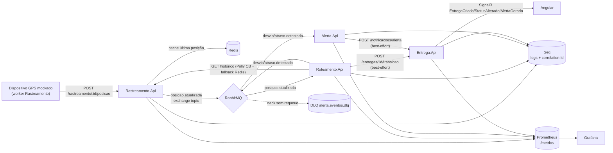

# Plataforma de Rastreamento e Monitoramento de Logística (.NET)

[](https://github.com/andrelima28439/logistica-plataforma/actions/workflows/ci.yml)
[](LICENSE)

Microsserviços de rastreamento de entregas em .NET com ênfase em **sustentação** — observabilidade profunda, troubleshooting e resiliência (circuit breaker, DLQ, degradação graciosa), mais dashboard operacional em Angular com tempo real via SignalR.

Decisões técnicas (ADRs) em `docs/decisoes-tecnicas.md`. Guia de incidentes em `docs/troubleshooting.md`.

| Serviço | Responsabilidade |
|---|---|
| `Entrega.Api` (`:5001`) | CRUD de entregas, máquina de estados, Hub SignalR |
| `Rastreamento.Api` (`:5002`) | GPS mockado (worker), `posicao.atualizada`, cache Redis |
| `Roteamento.Api` (`:5003`) | Strategy por tipo de carga, circuit breaker (Polly), `desvio/atraso.detectado` |
| `Alerta.Api` (`:5004`) | Factory de canais (e-mail/SMS/painel mock), DLQ |
| Frontend (`:4200`) | Dashboard, alertas, saúde do sistema, simulador |

## Arquitetura



**Fluxo:** `POST /entregas` cria a entrega (`CRIADA`) → Hub avisa `EntregaCriada` → worker GPS publica posições → `posicao.atualizada` → `Roteamento.Api` resolve a Strategy pelo tipo de carga e analisa → desvio/atraso vira evento no RabbitMQ → `Alerta.Api` persiste e aciona canais pela Factory → broadcast `AlertaGerado`; `Roteamento.Api` transita o status (`DESVIO_DETECTADO`/`ATRASADA`) → broadcast `StatusAlterado`. Dashboard atualiza sem F5. Falhas: circuit breaker com fallback Redis, DLQ para poison messages, ingestão resiliente sem broker (detalhes em `docs/troubleshooting.md`).

## Pré-requisitos

- Docker + Docker Compose
- .NET SDK 8
- Node 22+ + npm

## Como rodar do zero

```bash
# 1. Infraestrutura (SQL Server, RabbitMQ, Redis, Seq, Prometheus, Grafana)
docker compose up -d

# 2. Aguardar tudo healthy
docker compose ps

# 3. Backend (.NET SDK 8, um terminal por API ou background)
dotnet build src/LogisticaPlataforma.sln
dotnet run --project src/Entrega.Api --launch-profile http --no-build
dotnet run --project src/Rastreamento.Api --launch-profile http --no-build
dotnet run --project src/Roteamento.Api --launch-profile http --no-build
dotnet run --project src/Alerta.Api --launch-profile http --no-build

# 4. Frontend
cd frontend && npm ci && npx ng serve   # http://localhost:4200

# 5. Testes
dotnet test src/LogisticaPlataforma.sln
node scripts/smoke-signalr.mjs      # prova tempo-real via SignalR
```

UIs úteis: RabbitMQ http://localhost:15672 (logistica/logistica-dev-2026) · Seq http://localhost:8081 · Prometheus http://localhost:9090 · Grafana http://localhost:3000 (admin/admin) · Frontend http://localhost:4200.

## Demonstração do fluxo (curl)

Substitua `<ENTREGA_ID>` pelo `id` retornado no passo 1 em cada comando abaixo (sem variáveis de ambiente — os comandos valem para bash e PowerShell; no Windows PowerShell use `curl.exe` no lugar de `curl`, que lá é alias do `Invoke-WebRequest`; no CMD troque as aspas simples do `-d` por aspas duplas escapadas).

```bash
# 1. criar entrega (REFRIGERADA tem tolerância menor — ver ADR-013)
curl -s -X POST http://localhost:5001/entregas -H "Content-Type: application/json" -d '{"origem":"São Paulo/SP","destino":"Santos/SP","transportadorId":"transp-demo","tipoCarga":"REFRIGERADA","prazoEstimado":"2026-09-28T12:00:00-03:00"}'
# => {"id":"<ENTREGA_ID>",...} — copie o id e substitua <ENTREGA_ID> nos comandos abaixo

# 2. cadastrar contexto de rota no Roteamento (rota esperada longe = desvio garantido)
curl -s -X POST http://localhost:5003/roteamento/entregas -H "Content-Type: application/json" -d '{"entregaId":"<ENTREGA_ID>","tipoCarga":"REFRIGERADA","rotaEsperada":[{"latitude":-22.9068,"longitude":-43.1729}]}'

# 3. ligar GPS mockado (posição a cada 2s)
curl -s -X POST http://localhost:5002/rastreamento/<ENTREGA_ID>/simulacao/iniciar -H "Content-Type: application/json" -d '{"intervaloSegundos":2}'

# 4. consultar alertas gerados (DESVIO/CRITICA => email+sms+painel, ver ADR-017)
curl -s "http://localhost:5004/alertas?tipo=DESVIO"

# 5. detalhe da entrega (posições + eventos)
curl -s http://localhost:5001/entregas/<ENTREGA_ID>

# 6. estado do circuit breaker (Closed/Open/HalfOpen, ver ADR-015)
curl -s http://localhost:5003/roteamento/circuit-breaker
```

Comportamento esperado: em segundos o dashboard (http://localhost:4200) mostra `StatusAlterado` + `AlertaGerado` sem refresh. O smoke `node scripts/smoke-signalr.mjs` automatiza esse fluxo e assert os dois eventos via SignalR em <40s.

## Demonstração via Postman

Importe a collection (variables `entrega`/`rastreamento`/`roteamento`/`alerta` já apontam para `localhost:5001-5004`):

- `postman/logistica-plataforma.postman_collection.json`

Rode na ordem: **1. Criar entrega** → **2. Simular posições normais** (ou **2b. Ligar GPS mockado**) → **3. Simular desvio de rota** → **4. Gap de sinal** → **5. Consultar alertas** → **6. Observar circuit breaker** (após parar a `Rastreamento.Api`).

## Testes

```bash
dotnet test src/LogisticaPlataforma.sln
```

63 testes (domínio + API + estratégia + resiliência + mensageria, com `WebApplicationFactory` e fakes — sem infra externa): máquina de estados da entrega (TDD, 18 casos) + REST da entrega (9) + rastreamento/GPS (11) + Strategy por carga (4) + circuit breaker (2) + Roteamento API (3) + Factory de canais (6) + poison/DLQ (5) + smoke SignalR (`scripts/smoke-signalr.mjs`, ponta a ponta real).

Cobertura (Coverlet, gerado no `dotnet test --collect:"XPlat Code Coverage"`): `coverage/**/coverage.cobertura.xml` (upload como artifact no CI).

## Observabilidade

- Logs em JSON nas 4 APIs via Serilog → Seq (http://localhost:8081) + Console, com `Servico` e `CorrelationId` em toda linha (ver ADR-021, ADR-022)
- Correlation-id: envie `X-Correlation-Id` (ou receba um gerado de volta no response); ele viaja no header AMQP + corpo do evento até Roteamento/Alerta
- Métricas: `/metrics` nas 4 APIs (prometheus-net); Prometheus em http://localhost:9090, Grafana em http://localhost:3000 com dashboard `logistica-operacional` provisionado (8 painéis)
- Métricas de negócio/resiliência: `entregas_criadas_total`, `rastreamento_posicoes_total{origem}`, `roteamento_analises_total{resultado}`, `roteamento_circuito_estado` (gauge 0/1/2), `alerta_processados_total{tipo}`, `alerta_canais_total{canal}`, `alerta_dlq_mensagens`
- Health: `/health` (JSON, com dependências reais — SQL `SELECT 1`, AMQP, `PING`, `GET /health` do vizinho) + `/health/live` (só processo, para liveness do K8s — ver ADR-033)

## Estrutura

```
logistica-plataforma/
├── docker-compose.yml
├── src/LogisticaPlataforma.sln
├── src/Entrega.Api/          (gestão de entregas + Hub SignalR)
├── src/Rastreamento.Api/     (ingestão GPS + worker + Redis + publish)
├── src/Roteamento.Api/       (Strategy + Polly CB + fallback Redis)
├── src/Alerta.Api/           (Factory de canais + consumer com DLQ)
├── src/Shared.Kernel/        (eventos + correlation-id + health JSON)
├── tests/Entrega.Tests/ tests/Rastreamento.Tests/
├── tests/Roteamento.Tests/ tests/Alerta.Tests/
├── frontend/                 (Angular 20 standalone)
├── infra/prometheus/ infra/grafana/
├── k8s/                      (manifests Minikube)
├── postman/
├── scripts/smoke-signalr.mjs
├── docs/decisoes-tecnicas.md docs/troubleshooting.md
└── .github/workflows/ci.yml
```

## Como rodar no Minikube

Pré-requisitos: `docker compose up -d` no host (SQL, RabbitMQ, Redis, Seq ficam no Compose; os pods alcançam via `host.minikube.internal`) e `kubectl` + `minikube` no `PATH`.

```bash
# 1. Cluster
minikube start --driver=docker --memory=4g --cpus=2

# 2. Imagens (build local + carga no Minikube)
docker build -t logistica/entrega-api:1.0 -f src/Entrega.Api/Dockerfile .
docker build -t logistica/rastreamento-api:1.0 -f src/Rastreamento.Api/Dockerfile .
docker build -t logistica/roteamento-api:1.0 -f src/Roteamento.Api/Dockerfile .
docker build -t logistica/alerta-api:1.0 -f src/Alerta.Api/Dockerfile .
docker build -t logistica/frontend:1.0 -f frontend/Dockerfile .

# Carga das imagens no Minikube — bash:
for i in entrega-api rastreamento-api roteamento-api alerta-api frontend; do
  minikube image load logistica/${i}:1.0
done

# Carga das imagens no Minikube — PowerShell:
# foreach ($i in @("entrega-api","rastreamento-api","roteamento-api","alerta-api","frontend")) {
#   minikube image load "logistica/${i}:1.0"
# }

# 3. Manifests (namespace primeiro — o apply em lote tem race alfabética)
kubectl apply -f k8s/namespace.yaml
kubectl apply -f k8s/configmap.yaml -f k8s/secret.yaml -f k8s/entrega-api.yaml \
  -f k8s/rastreamento-api.yaml -f k8s/roteamento-api.yaml -f k8s/alerta-api.yaml -f k8s/frontend.yaml

# 4. Aguardar rollout
kubectl -n logistica rollout status deploy/roteamento-api --timeout=240s
kubectl -n logistica get pods   # esperado: 5/5 Running 1/1
```

**Acesso:** se a rede da VM do Minikube não for roteável do host, use `port-forward`:

```bash
kubectl -n logistica port-forward svc/entrega-api 30501:8080
kubectl -n logistica port-forward svc/rastreamento-api 30502:8080
kubectl -n logistica port-forward svc/roteamento-api 30503:8080
kubectl -n logistica port-forward svc/alerta-api 30504:8080
kubectl -n logistica port-forward svc/frontend 30080:80
# APIs em http://localhost:30501-30504 · frontend em http://localhost:30080
# (o frontend detecta o host e usa as portas 30501-30504 fora do localhost — ver ADR-034)
```

**Probes:** liveness → `/health/live` (só processo, sem dependências); readiness → `/health` (com dependências reais — ver ADR-033). Comportamento verificado: com `rastreamento-api` escalado para 0 réplicas, o pod do `roteamento-api` fica `0/1 Running` com `RESTARTS 0` (sai do tráfego sem reiniciar) e volta a `1/1` ao escalar de volta:

```bash
kubectl -n logistica scale deploy/rastreamento-api --replicas=0
kubectl -n logistica get pods   # roteamento-api 0/1, RESTARTS 0
kubectl -n logistica scale deploy/rastreamento-api --replicas=1
```

**Configuração:** ConfigMap `logistica-config` (hosts/URLs/tuning, nada secreto) + Secret `logistica-secret` (somente dev local — em produção, trocar pelo Secret do provedor e não commitar).

## Limitações conhecidas (e o que seria diferente em produção)

- **GPS mockado** (random walk SP) — produção: integração com telemetria real.
- **Canais e-mail/SMS mockados** (outbox em memória) — produção: SES/Twilio.
- **Persistência em memória** (SQL Server provisionado + health real, mas sem EF ainda — ver ADR-003) — produção: EF Core + migrations + outbox transacional.
- **Sem autenticação** (Seq local sem login, APIs abertas) — decisão consciente para focar em resiliência/observabilidade.
- **Eventos durante queda do broker são perdidos** — produção: outbox ou redelivery (ver ADR-026; troubleshooting, Cenário 1).
- **Secret do K8s com valores dev** — produção: Secret do provedor, sem commit.

## CI

`.github/workflows/ci.yml` (push/PR): `backend` (build + `dotnet format whitespace --verify-no-changes` + `dotnet test` com Coverlet + upload do XML) + `frontend` (`npm ci` + `ng lint` + build produção) + `docker` (build das 5 imagens, sem push).

## Licença

Distribuído sob a licença MIT. Veja o arquivo LICENSE para mais detalhes.
